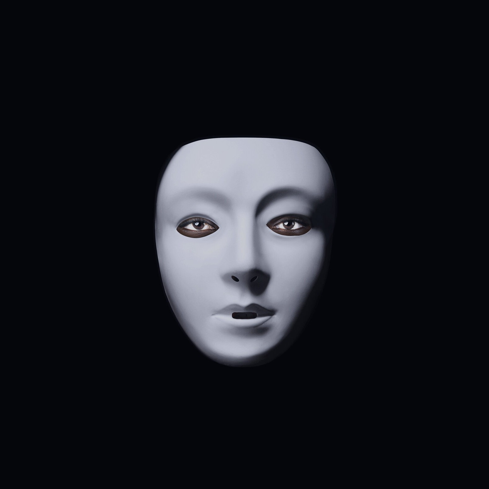

# 📝 Quiz: Algoritmo Justo ou Racista?



Imagem retirada do trailer do documentário "Coded Bias" disponivel na netflix:

```
https://www.netflix.com/br/title/81328723
```

## 🎯 Objetivo do Jogo

Este quiz foi desenvolvido para conscientizar sobre como os algoritmos e sistemas de IA podem perpetuar vieses raciais, especialmente quando utilizam dados históricos contaminados por preconceitos estruturais.

## 🌐 Contexto Social

Os algoritmos não são neutros - eles refletem os vieses presentes nos dados com que são treinados e nas equipes que os desenvolvem. Problemas como:

- **Reconhecimento facial** com até 35% mais erros para mulheres negras (estudos do MIT)
- **Sistemas de crédito** que discriminam minorias
- **Ferramentas de contratação** que privilegiam candidatos brancos

## 🕹️ Como Jogar

1. **Início**:

   - Digite seu nome
   - Clique em "Play" para começar
2. **Quiz**:

   - Responda 10 questões sobre vieses algorítmicos
   - Todas as questões devem ser respondidas antes de verificar
3. **Resultados**:

   - Veja seu desempenho (acertos/erros)
   - Acesse explicações detalhadas sobre cada questão
4. **Créditos**:

   - Conheça os desenvolvedores
   - Jogue novamente se desejar

## 🛠️ Tecnologias Utilizadas

- HTML5, CSS3, JavaScript puro
- Design responsivo para todos os dispositivos
- Animações e feedback visual interativo

## 👥 Público-Alvo

- Estudantes de tecnologia
- Profissionais de TI e ciência de dados
- Público interessado em justiça social digital

## 📌 Exemplo de Caso Real

Um dos casos abordados no quiz:

> "Em 2018, um sistema de reconhecimento facial da Amazon falhou em 28% dos testes com mulheres negras, enquanto errou em 0% para homens brancos."

## 🌟 Por que isso importa?

Entender esses vieses é o primeiro passo para:

1. Desenvolver algoritmos mais justos
2. Exigir transparência das empresas
3. Criar regulamentações eficazes

## 📦 Estrutura de Arquivos

```
.
├── Imagens/
│   ├── circuito.png         # Textura de fundo
│   ├── CODED_Cover_Films.jpg # Capa
│   └── ...                  # Fotos dos participantes
├── index.html               # Página principal
├── script.js                # Lógica do jogo
├── styles.css               # Estilos visuais
└── README.md                # Este arquivo

```

## 🚀 Como Executar

1. Clone o repositório
2. Abra `index.html` em qualquer navegador moderno
3. Ou acesse online: ainda irei colocar o link quando hospedar
